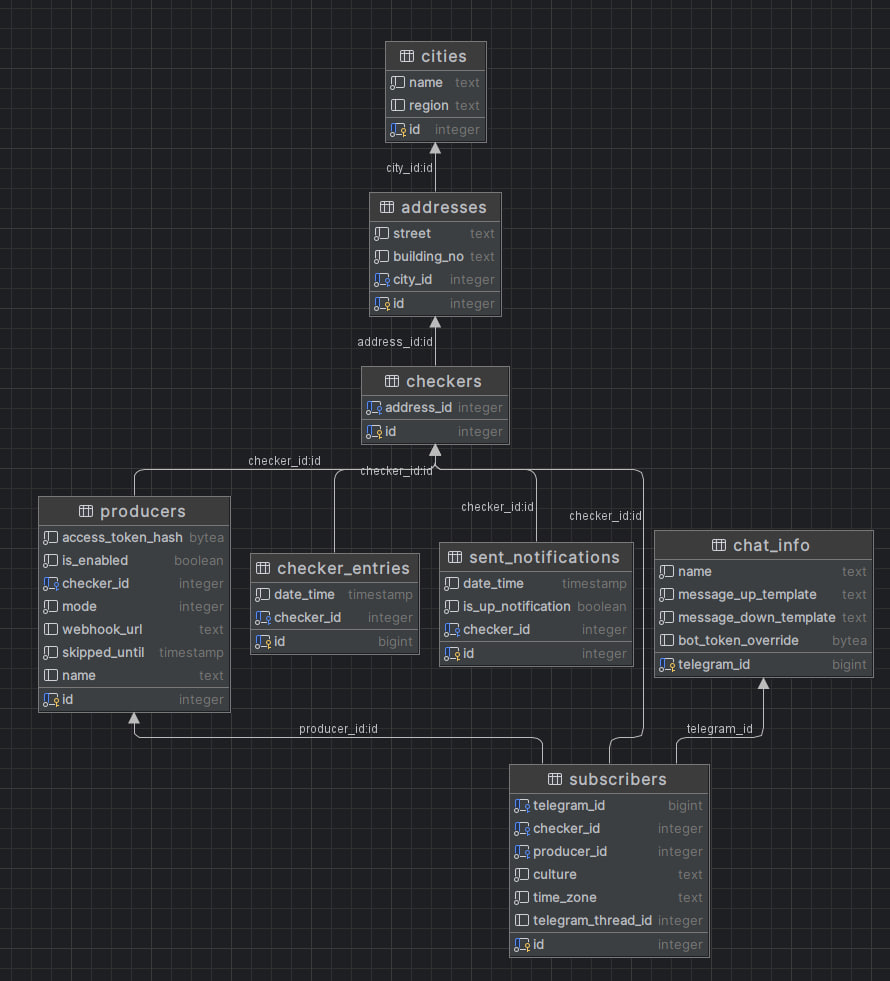

## Release 2.0

Includes:
- Upgrade .NET SDK to 8.0
- Simplify database schema
- Update dependencies

### Database schema changes



Old schema is a bit overcomplicated, that's why I decided to simplify it.

Steps:
1) rework main tables: `checkers`, `checker_entries`, `sent_notifications`
   - rename `checkers` to `locations` (represents specific location that is being tracked by the application)
   - rename all `checker_id` columns to `location_id`
   - `locations` table is extended with new columns
     - `full_address` (not null, text)
     - `is_online` (not null, boolean)
     - `last_seen_at` - last time when location was seen online (not null, timestamp)
     - `last_notified_at` - last time when the notifications were sent to Telegram (not null, timestamp)
     - `city_id` - key is taken from existing `address_id` constraint (not null, foreign key, integer)
     - `is_down = date() - last_seen_at > 1 min`
     - `is_already_notified = last_notified_at >= last_updated_at`
   - delete `checker_entries` table
     - last entry is used to set `locations.last_seen_at` and `locations.last_updated_at`
     - since we don't rely on the history of every ping anymore, we define 2 separate columns mentioned above
   - delete `sent_notifications` table
     - last entry is used to set `locations.last_notified_at`
2) Add table `availability_history`
   - table doesn't compose the existing data from `checker_entries`, new data is collected instead
   - this table is unused in version 2.0, but there is a plan to implement statistics functionality later
   - columns:
     - id (primary key)
     - duration (timespan, not null)
     - status (integer, 0 is Offline and 1 is Online, not null)
     - begin_at (timestamp, not null)
     - end_at (timestamp, not null)
     - location_id (integer, foreign key, not null)
3) Remove `addresses` table, move existing addresses to `locations.full_address` as plain text.
This allows to setup as many locations per 1 real address as you want.
4) Remove `subscribers.producer_id` column, so there is no reference between subscribers and producers,
instead the `locations` table connects them.

### API changes

#### v2 endpoints

All endpoints are moved to `/v2` prefix. Support for `/v1` endpoints is dropped, backwards compatibility is not relevant.

#### New endpoint for location creation

**Request:**
[POST] /v2/location

```json
{
  "cityId": 1,
  "fullAddress": "вулиця Михайла Грушевського, 5, Київ, 01008"
}
```

**Response:**

```json
{
  "accessToken": "b5SXYMyf7DuiUsMrURWp"
}
```

### Future plans

#### Version 2.1

- Add an ability to customize the interval after which location is considered offline.
- Refactor Telegram update handler to make it more maintainable.
- Add authentication for producers creation.

#### Version 2.2

- Implement statistics functionality.
- Limit how many subscribers and producers can be registered without my consent.

#### Version 3

- Implement administrative web dashboard.
- Add page that can be attached as web page sent by Telegram bot.
- Optimize custom token overriding workflow.